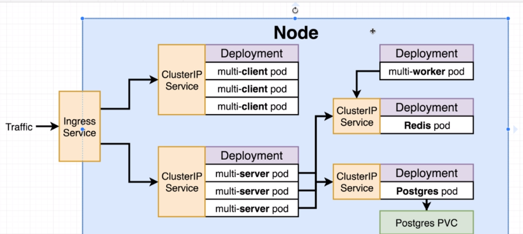
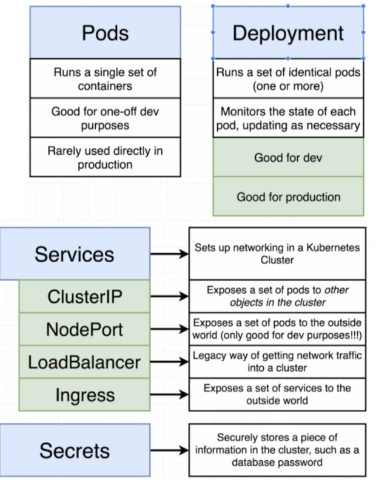
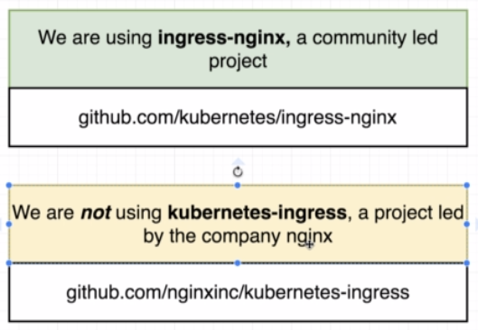

# Solution Diagram



# k8s components



# Ingress Usage

We're using for this project the ingress-nginx from the kubernets github repository. `the green one`.



### Fix for Postgres CrashLoopBackOff Error on Windows Pro

This note is only for students that are on Windows Pro and are using Docker Desktop's built-in Kubernetes. If you are using Docker for Mac's Kubernetes or Minikube this issue will not apply to you and can be skipped.

In the next lecture, we will be running a kubectl apply -f k8s after creating our PersistentVolumeClaim. You will likely notice that your Postgres pod will show a status of CrashLoopBack.

To resolve this we need to create a PersistentVolume in addition to the PersistentVolumeClaim.

You can refer to the official Kubernetes docs here:

https://kubernetes.io/docs/tasks/configure-pod-container/configure-persistent-volume-storage/

1. Create a database-persistent-volume.yaml and enter the following:
```
kind: PersistentVolume
apiVersion: v1
metadata:
  name: database-persistent-volume
  labels:
    type: local
spec:
  storageClassName: manual
  capacity:
    storage: 2Gi
  accessModes:
    - ReadWriteOnce
  hostPath:
    path: "/mnt"
```
	
The docs specify that you should SSH into the node and create a data directory under /mnt but we could similarly just specify /mnt or as another student mentioned /tmp as the hostPath

2. Create the database-persistent-volume-claim.yaml file:
```
kind: PersistentVolumeClaim
apiVersion: v1
metadata:
  name: database-persistent-volume-claim
spec:
  storageClassName: manual
  accessModes:
    - ReadWriteOnce
  resources:
    requests:
      storage: 2Gi
```	  
This is pretty similar to what is used in the course,  except that we are adding `storageClassName` which binds PersistentVolumeClaim requests to the PersistentVolume.

3. Run `kubectl apply -f k8s`

4. Run `kubectl get pods` and the postgres pod should show a status of Running
